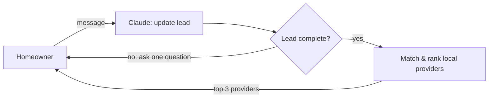

In this blog, I'll be explaining my process in building out a home services dispatch agent in 10 hours.

* TOC placeholder — kramdown replaces this list with the real table of contents
{:toc}

## Scoping The Task Down

The stated main goal was essentially good conversation quality, and so I dropped most things that did not 
directly contribute to the quality of the conversation: auth, UI improvements, and any provenance for
sessions. That directly lowered the amount of database tables and columns I had, as well as a lot of 
python components I would have had to build. 

In addition, my app **only has data for providers in the Chicagoland area** for the V1.

## Key Design Decisions

Still, a MVP left me with some decisions to make about the system. 

**1. Structured retrieval instead of vector search.** My first instinct was RAG: embed the
providers and retrieve the closest matches to the homeowner's problem. But the provider data is
already structured (a category, a location, a rating, a review count), and the question we need
answered is exact: "plumbers within 25 miles of this ZIP." 

**2. Provider ranking system.** I wanted to account for both average stars and number of ratings.
A 5.0 from 3 reviews could just be luck, while a 4.7 from 400 is a track record. So I ranked
providers by a Bayesian average:

```
score = (reviews × rating + 50 × category_average) / (reviews + 50)
```

which essentially pulls providers with very few reviews toward the category average.

**3. SQLite for provider data.** I knew the data for this MVP would be small enough to fit into SQLite easily,
so it made a lot of sense just to use SQLite, which is also faster since it lives directly on disk. 

## Being the Human in the Loop

**1. Understanding the problem.** First I used Claude to get up to speed on the domain
how home-service diagnosis conversations looked like to get a sense of what I needed to build. 

**2. Brainstorming solutions.** Next, I talked through possible approaches: how the conversation
should be driven, how to match a homeowner to a provider, and what "done" looks like for a single
conversation. This is where ideas like RAG came up and got ruled out.

**3. Choosing the tech stack.** With an approach in mind, I picked tools that would let me move
fast and would work. 

**4. Writing design docs for the MVP.** I wrote a [system design](https://github.com/dudu-theman/dispatch_agent/blob/main/docs/design_docs/2026-10-08_system_design.md)
and a [database schema](https://github.com/dudu-theman/dispatch_agent/blob/main/docs/design_docs/2026-10-08_database_schemas.md)
doc before writing any code. These pinned down every component, what it was responsible for, and
whether it was the LLM's job or plain code's job.

**5. Splitting up the work, then building.** From the design doc, I broke the system into
components that could each be built and tested on their own: the lead state and completeness
check, the state updater, the geocoder, the provider matcher and ranker, and the API, before having 
Claude build them out. 

## The Architecture (Briefly)

Each message, Claude updates the lead, and plain code checks whether it's complete: if not, the
agent asks one more question; if so, it returns the top 3 local providers.



## What I'd Build Next

There's a bit more that would need to go into this to be a production system, although I 
believe I hit on the core requirement, which is the conversation and retrieval system.

### Hardening for Production

Auth, persistant conversations, and adding provenance. 

Leads are in memory, and could be persisted to a database so that they aren't lost on a restart.

To keep the V1 simple, I also dropped a lot of columns that tell you where
data came from: which site a provider's reviews came from, review ids, when a provider was
last verified, etc. I'd add these back in as they would be useful in a long-term production system. 

### Closing the Feedback Loop

Once conversations are persisted, they become data I can learn from.

Firstly, I'd add some observability to trace each conversation. 

I'd also add some feedback loop to get user feedback, and then also have an LLM be the judge to
grade each conversation in some way so we could improve our retrieval. 

### Better Matches, More Places

Currently, distance is measured from the center of a ZIP code, though using the homeowner's
actual location would make the 25-mile radius even more accurate.

The provider data only covers Chicago and its suburbs. I'd scale this to more regions in the future. 

https://dispatchagent-ui.vercel.app/