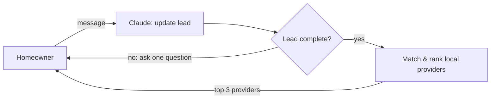

## Architecture

```mermaid
flowchart LR
    user["Homeowner"]
    agent["Claude: update lead"]
    check{"Lead complete?"}
    match["Match & rank local providers"]

    user -->|"message"| agent
    agent --> check
    check -->|"no: ask one question"| user
    check -->|"yes"| match
    match -->|"top 3 providers"| user
```
